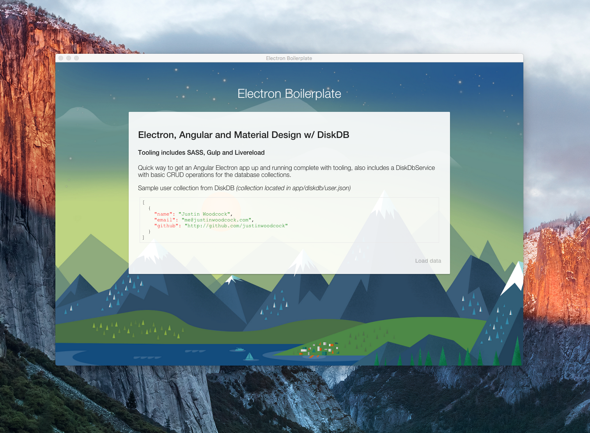

# Electron Boilerplate

### Electron, Angular and Material Design w/ DiskDB, tooling includes SASS, Gulp and Livereload

Quick way to get an Angular Electron app up and running complete with tooling, also includes a DiskDbService with basic CRUD operations for the database collections.




### Dependencies

Install global dependencies

```
npm i -g gulp bower
```

Install all local dependencies.

```
  npm i
```

### Serve

Serve the project using gulp.

```
  gulp serve
```


